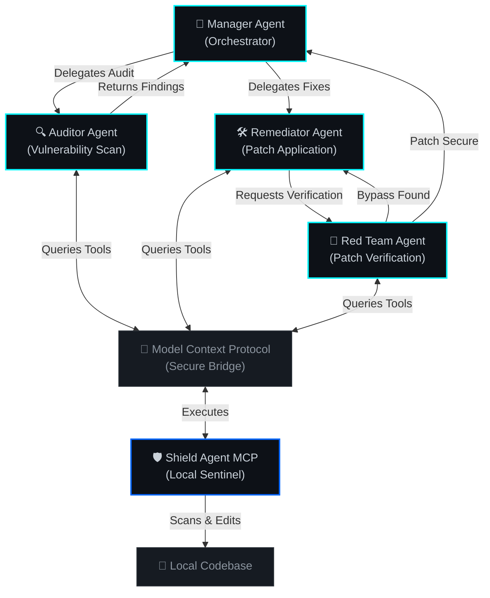

<!-- PROFILE BANNER -->

  

<h1 align="center">Bhanu Vamsi Krishna</h1>
<h3 align="center">Agentic Systems Architect · Telecom Protocol Engineer · AI Security Specialist</h3>

  

  <!-- REPO_BADGE_START -->
  
  <!-- REPO_BADGE_END -->
  <!-- TELECOM_BADGE_START -->
  
  <!-- TELECOM_BADGE_END -->
  <!-- UTILITY_BADGE_START -->
  
  <!-- UTILITY_BADGE_END -->
  
  

<!-- FOCUS_SECTION_START -->

  🎯 <b>Current Focus:</b> <a href="https://github.com/gbvk312/multi-agent-orchestrator">Hardening the asynchronous multi-agent orchestrator framework</a>

<!-- FOCUS_SECTION_END -->

---

### 🧠 About

I architect **autonomous, multi-agent systems** that secure code, infrastructure, and AI-to-AI interactions. My work sits at the intersection of **Agentic AI**, **Telecom (5G)**, and **DevSecOps** — building tools that don't just detect problems, but orchestrate their resolution.

> *"The best way to predict the future is to automate it."*

---

### 🛡️ The Shield Ecosystem

My primary focus: a **unified, local-first security framework** built for the MCP (Model Context Protocol) era.

<b>Ecosystem Architecture</b>

 

<table>
  <tr>
    <td width="33%" valign="top">
      <h4>🔒 <a href="https://github.com/gbvk312/shield-agent-mcp">Shield Agent MCP</a></h4>
      
<i>The Sentinel — Hybrid-AI Security & Quality Auditor</i>

      <ul>
        <li>🔍 Proactive deep-scanning for PII, secrets & architectural drift</li>
        <li>🛡️ Privacy-first: local analysis with secure LLM orchestration</li>
        <li>🔌 MCP-native tool designed for agent ecosystems</li>
        <li>🤖 Gemini-powered intelligent code review</li>
      </ul>
    </td>
    <td width="33%" valign="top">
      <h4>🧠 <a href="https://github.com/gbvk312/shield-orchestrator">Shield Orchestrator</a></h4>
      
<i>The Brain — Multi-Agent DevSecOps Framework</i>

      <ul>
        <li>🔄 Agent-to-agent handoff with intelligent routing</li>
        <li>🛠️ Automated vulnerability scanning & remediation</li>
        <li>📊 Network reconnaissance & attack surface mapping</li>
        <li>⚡ Model failover with rate-limit resilience</li>
      </ul>
    </td>
    <td width="33%" valign="top">
      <h4>⚡ <a href="https://github.com/gbvk312/multi-agent-orchestrator">Multi-Agent Orchestrator</a></h4>
      
<i>The Engine — Async Multi-Agent Core</i>

      <ul>
        <li>🚀 Async-first event-driven architecture for rapid execution</li>
        <li>🤖 Native support for Gemini context caching</li>
        <li>🧠 State-preserving conversation & session memory</li>
        <li>🔌 Highly pluggable framework design</li>
      </ul>
    </td>
  </tr>
</table>

---

### 🛸 Specialized Showcases

<table>
  <tr>
    <td width="50%" valign="top">
      <h4>🎮 <a href="https://github.com/gbvk312/clash-of-clans-premium-dashboard">Clash of Clans Premium Dashboard</a></h4>
      
<i>The Visualizer — Live Gaming Analytics & Strategy Hub</i>

      <ul>
        <li>💎 Premium glassmorphic design featuring custom visualizers</li>
        <li>📊 Live analytics: player comparisons and clan war attack matrices</li>
        <li>⚡ Zero-dependency browser caching with high-performance LRU cache</li>
        <li>🌐 Clean integration with official Supercell Clash of Clans APIs</li>
      </ul>
    </td>
    <td width="50%" valign="top">
      <h4>📡 <a href="https://github.com/gbvk312/3GPP-Knowledge-Graph-Agent">3GPP Knowledge Graph Agent</a></h4>
      
<i>The Architect — Serverless Telecom Intelligence System</i>

      <ul>
        <li>🧠 Multi-agent RAG reasoning engine for parsing telecom specs</li>
        <li>🕸️ Knowledge graph mapping complex 3GPP protocol relationships</li>
        <li>☁️ Enterprise AWS Stack: Bedrock, Neptune Graph Database, and CDK</li>
        <li>🔬 Interactive dependency graphs designed for rapid protocol analysis</li>
      </ul>
    </td>
  </tr>
</table>

---

### 📡 Specialized Hubs

Beyond my personal repos, I maintain large-scale toolkits across dedicated organizations:

| Hub | Focus | Description |
|:----|:------|:------------|
| [📡 Telecom Test Tools](https://github.com/telecom-test-tools) | 5G Protocol Analysis | Advanced log monitoring, protocol validation, and test automation for telecom infrastructure |
| [🛠️ gbvk Utilities](https://github.com/gbvkUtilities) | DevEx & Automation | Extensive collection of Python CLI tools for developer productivity and workflow automation |

### 🛠️ gbvk Utilities Spotlight
*A rotating showcase of developer tools from my 90+ custom utility repositories, updated daily.*

<!-- UTILITY_SPOTLIGHT_START -->

| Tool | Description |
| :--- | :--- |
| [🛠️ pii-scanner-cli](https://github.com/gbvkUtilities/pii-scanner-cli) | Scan files for Personally Identifiable Information (PII) like Credit Cards, SSNs, and Emails. |
| [🛠️ ascii-chart-cli](https://github.com/gbvkUtilities/ascii-chart-cli) | Render beautiful ASCII bar charts, line plots, and sparklines directly in the terminal from CSV, JSON, or piped stdin data. |
| [🛠️ readme-toc-generator](https://github.com/gbvkUtilities/readme-toc-generator) | A simple, dependency-free CLI tool to automatically generate a Table of Contents for Markdown files. |
<!-- UTILITY_SPOTLIGHT_END -->

---

### 🔬 Current Research: Model Context Protocol (MCP)

I'm exploring how **MCP** transforms the way AI agents interact with tools, codebases, and each other. My active research areas:

- **Agent-to-Agent Security**: Establishing trust and verification patterns for autonomous AI interactions
- **Local-First Intelligence**: Hybrid architectures that combine local deep-scanning with cloud LLM reasoning
- **Protocol-Native Tooling**: Building security tools as first-class MCP resources, not bolt-on integrations

---

### 🛠️ Tech Stack & Domain Specialization

| Domain | Technologies & Tools |
| :--- | :--- |
| **Agentic & AI Core** | `Gemini API` `AWS Bedrock` `LangChain` `Multi-Agent Routing` `RAG` |
| **Telecom & Protocols** | `5G Core (5GC)` `3GPP Standards` `Protocol Verification` `L2/L3 Layers` |
| **Backend & APIs** | `Python` `FastAPI` `PostgreSQL` `Amazon Neptune` `JSON-RPC` `REST APIs` |
| **DevOps & Cloud** | `Docker` `Terraform` `AWS` `GCP` `Ansible` `GitHub Actions` `Linux` |

  

---

### 📊 System Metrics

  
  

  

---

  

  <!-- SYSTEM_STATUS_START -->
  <i>Last System Pulse: 2026-07-14 02:43 UTC • Total Portfolio Stars: ⭐ 0 • Automated via Profile Manager</i>
  <!-- SYSTEM_STATUS_END -->

  <!-- SECURITY_SENTINEL_START -->
  <i>🛡️ DevSecOps Shield: Scanned & Secure • 0 Secrets • 0 Vulns • Verified by Security Sentinel</i>
  <!-- SECURITY_SENTINEL_END -->

  ⚡ Building the bridge between traditional protocol expertise and autonomous AI orchestration.

